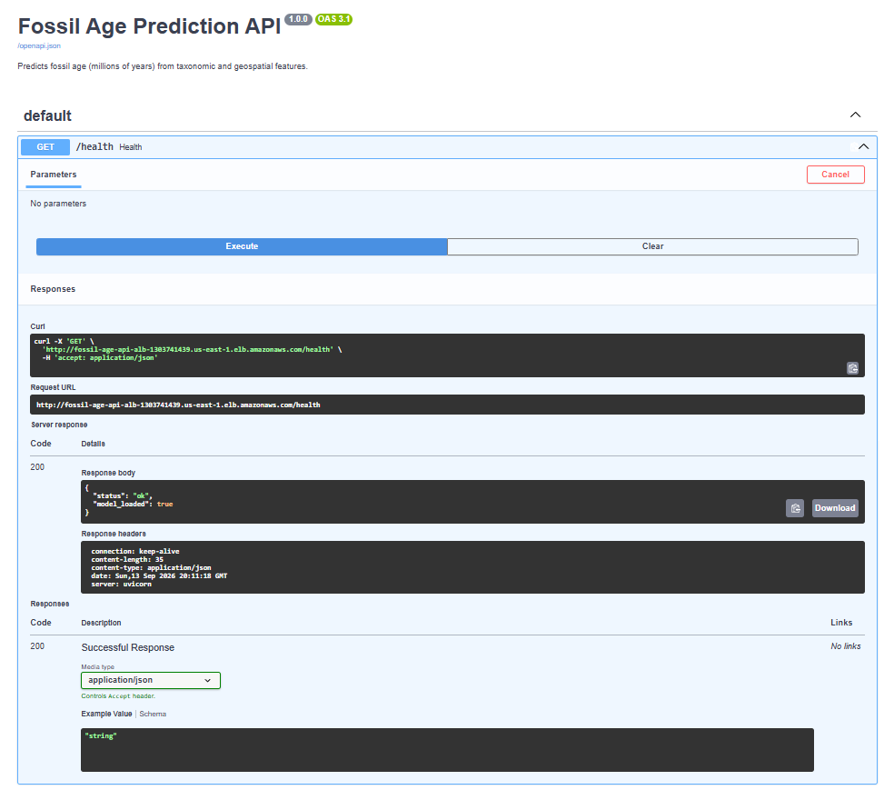
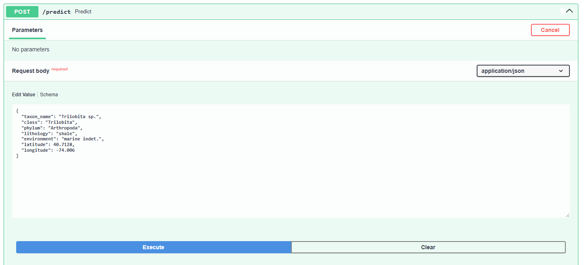
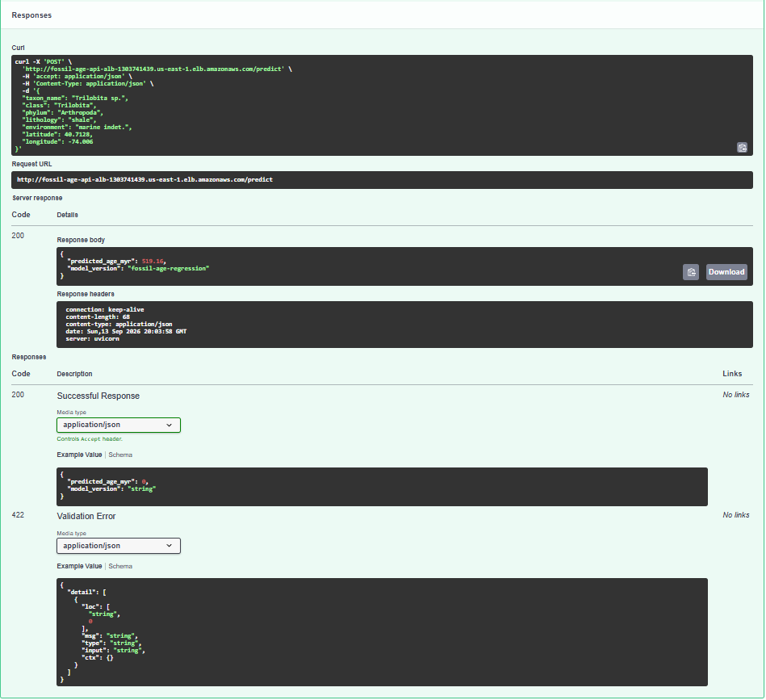

# Fossil Age Regression, MLOps Pipeline

This project predicts fossil age (in millions of years) from taxonomic and geospatial features. It started as a single Jupyter notebook and grew into a full pipeline: tracked experiments, a served API, a container, and cloud infrastructure provisioned as code.

**Model performance:** the tuned XGBoost model hits an R² of about 0.99 and RMSE of about 9.7 million years on held-out test data. That's a solid step up from Lasso (R² around 0.88) and even beats the untuned XGBoost baseline slightly.

## Architecture

```
Notebook (EDA + model comparison)
        │
        ▼
Modular pipeline (src/, run_pipeline.py)
   ├─ load, clean, encode, split, scale
   ├─ train: baseline, Lasso, XGBoost, tuned XGBoost (RandomizedSearchCV)
   └─ logged to MLflow (params, metrics, model registry)
        │
        ▼
FastAPI service (app/)
   ├─ GET  /health   checks model load status
   └─ POST /predict  takes fossil features, returns predicted age
        │
        ▼
Docker (Dockerfile)
   packages the API and trained model into a single container image
        │
        ▼
Terraform (terraform/) → AWS
   ├─ ECR             the container image registry
   ├─ ECS Fargate     runs the container, no servers to manage
   └─ Application Load Balancer, the public HTTP endpoint
```

## Why each layer is here

| Layer | What it solves |
|---|---|
| Modular pipeline | Notebook cells aren't reusable, testable, or callable from anywhere else |
| MLflow | Without it, every run's metrics just live in scrollback with no way to compare |
| FastAPI | A trained model sitting in a `.pkl` file isn't usable by anything else |
| Docker | "Works on my machine" isn't good enough. A container runs the same way anywhere |
| Terraform + AWS | Clicking around the AWS console isn't reproducible or version-controlled |

## Repo structure

```
├── Fossil_Age_Project.ipynb   original EDA and model comparison notebook
├── config.yaml                paths, hyperparameter search space, MLflow settings
├── run_pipeline.py            entry point, trains all 4 models and logs to MLflow
├── requirements.txt           core pipeline and API dependencies
├── requirements-notebook.txt  extra deps for the notebook only (plots, TensorFlow)
├── Dockerfile
├── src/
│   ├── data.py                load_data()
│   ├── preprocess.py          cleaning, encoding, train/test split, scaling
│   ├── train.py               baseline, Lasso, XGBoost, tuned XGBoost
│   └── evaluate.py            MSE, RMSE, R²
├── app/
│   ├── main.py                 FastAPI app: /health, /predict
│   └── schemas.py               request and response models
└── terraform/
    ├── main.tf, ecr.tf, network.tf, alb.tf, iam.tf, ecs.tf, outputs.tf
    └── DEPLOY.md               step by step AWS deployment guide
```

## Running it locally

```bash
pip install -r requirements.txt

# Get fossil_data.csv (see data/README.md) and place it at data/fossil_data.csv

python run_pipeline.py              # trains models, logs to MLflow, saves the tuned model
mlflow ui --backend-store-uri sqlite:///mlflow.db   # view experiment history

uvicorn app.main:app --reload       # serve the API locally
# then visit http://127.0.0.1:8000/docs
```

## Running it in Docker

```bash
docker build -t fossil-age-api .
docker run -p 8000:8000 fossil-age-api
```

## Deploying to AWS

See [`terraform/DEPLOY.md`](terraform/DEPLOY.md) for the full walkthrough (pushing to ECR, running Terraform, tearing it down). The short version: Terraform provisions an ECR repository and an ECS Fargate service behind an Application Load Balancer. The Docker image you build above gets pushed to ECR and pulled by ECS when you deploy.

```bash
cd terraform
terraform init
terraform apply -target=aws_ecr_repository.app   # create the registry first
# build, tag, and push the image to it (see DEPLOY.md)
terraform apply                                   # create everything else
terraform output load_balancer_url                # your public URL
```

**Note:** running this infrastructure costs a small amount per hour. Run `terraform destroy` (or delete the resources manually) when you're not actively demoing it.

## Live deployment screenshots

The API was deployed to AWS (ECS Fargate behind an Application Load Balancer) and confirmed working end to end. The infrastructure has since been torn down to avoid ongoing costs, but here's proof it ran:

**Health check**


**Predict request**


**Predict response**


## Known limitations

- The one-hot encoding step in `src/preprocess.py` carries over a small bug from the original notebook. `lithology` gets filled with `class`'s mode instead of its own. It's kept as is so results match the notebook, but there's a `TODO` in the code for anyone who wants to fix it and re-tune afterward.
- The AWS deployment runs a single ECS task with no redundancy. That's fine for a portfolio demo, but it's not meant to represent a production setup.
- The dataset isn't committed to the repo (see `data/README.md`). The original notebook pulled it from a Google Drive link.
